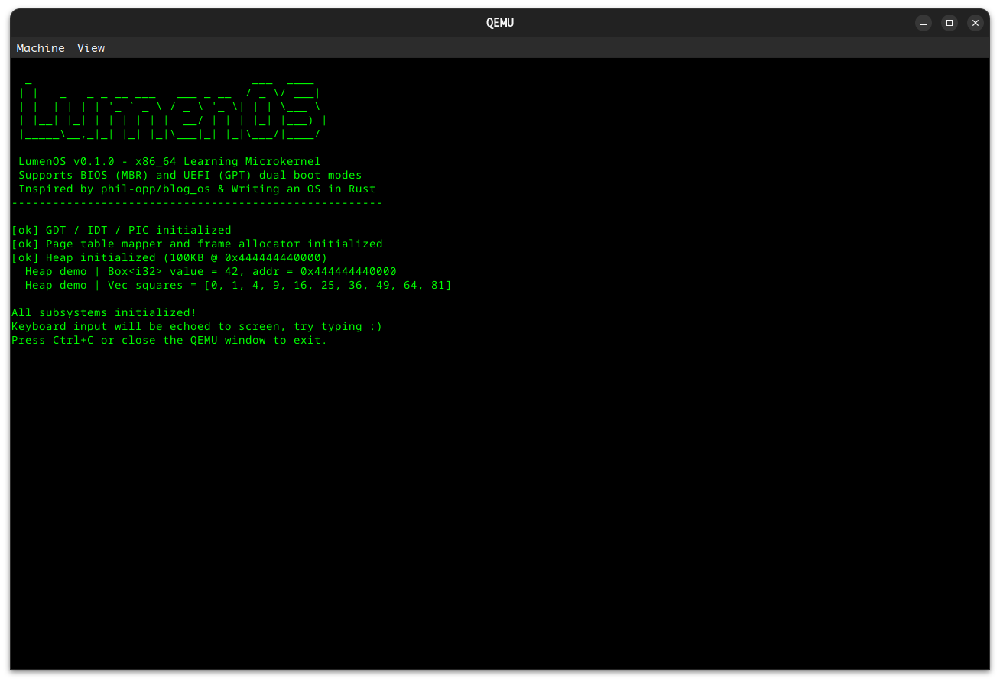

# LumenOS

**LumenOS**（源自拉丁语 *lumen*，意为"光"）是一个参考 [phil-opp/blog_os](https://github.com/phil-opp/blog_os) 设计的 **x86_64 学习型微内核操作系统**，支持 **BIOS (MBR)** 和 **UEFI (GPT)** 双启动模式。

本项目的目标是帮助学习者理解操作系统的核心概念，包括：裸机编程、帧缓冲区显示、中断处理、内存分页、堆分配等。代码包含大量中文注释，降低学习门槛。

## 设计原则

参考 [Writing an OS in Rust](https://os.phil-opp.com/) 系列教程（[中文翻译](https://github.com/rustcc/writing-an-os-in-rust)），本项目在以下方面有自己的特点：

- **BIOS + UEFI 双启动** — 使用 `bootloader_api` v0.11，同一份内核代码支持两种启动方式
- **帧缓冲区渲染** — 使用 `noto-sans-mono-bitmap` 字体在像素帧缓冲区上渲染文字
- **丰富的中文注释** — 每个模块都包含详细的原理说明和设计思路
- **模块化架构** — 清晰分离显示、串口、GDT、中断、内存管理等子系统
- **完整的启动链路** — 从固件引导到堆分配，覆盖操作系统启动的完整流程
- **自定义测试框架** — 支持通过串口输出测试结果，在 QEMU 中自动化测试
- **交互式键盘回显** — 启动后可直接在屏幕上看到键盘输入

## 运行效果

在 QEMU 中启动内核后，帧缓冲区会显示 **绿色等宽字 + 黑底** 的终端风格界面：ASCII 艺术横幅、版本信息（当前为 **v0.1.0**）、子系统初始化状态（GDT/IDT/PIC、页表与帧分配器、堆），以及 `Box<i32>` 与 `Vec` 的堆分配演示；随后提示键盘输入将回显到屏幕，可用 **Ctrl+C** 或关闭 QEMU 窗口退出。



## 功能概览

| 模块 | 文件 | 功能描述 |
|------|------|----------|
| 帧缓冲区显示 | `src/framebuffer.rs` | 像素帧缓冲区文本渲染，抗锯齿字体，滚屏，`println!` 宏 |
| 串口输出 | `src/serial.rs` | UART 16550 驱动，调试与测试输出 |
| GDT/TSS | `src/gdt.rs` | 全局描述符表 + 任务状态段 + 中断栈表 |
| 中断处理 | `src/interrupts.rs` | IDT + 断点/双重错误/页错误处理 + 定时器/键盘中断 |
| 内存管理 | `src/memory.rs` | 四级页表访问 + 物理帧线性分配器 |
| 堆分配 | `src/allocator.rs` | 堆初始化 + 链表分配器（支持 `Box`/`Vec`/`String`） |

## 环境要求

- **Rust nightly**（已通过 `rust-toolchain.toml` 固定，自动包含 `rust-src`、`llvm-tools-preview` 和 `x86_64-unknown-none` 目标）
- **[QEMU](https://www.qemu.org/)** (`qemu-system-x86_64`) — 运行内核镜像
- **[OVMF](https://github.com/tianocore/edk2)** — UEFI 固件（仅 UEFI 模式需要）

```bash
# 确认 QEMU 已安装
qemu-system-x86_64 --version

# 安装 OVMF（Ubuntu/Debian，UEFI 模式需要）
sudo apt install ovmf
```

## 构建与运行

```bash
# 编译内核
make build

# ── BIOS (MBR) 模式 ──
# 创建 BIOS 磁盘镜像
make bios-image

# 在 QEMU 中以 BIOS 模式运行
make run-bios

# ── UEFI (GPT) 模式 ──
# 创建 UEFI 磁盘镜像
make uefi-image

# 在 QEMU 中以 UEFI 模式运行（需要 OVMF）
make run-uefi

# ── 测试 ──
# 运行所有测试（单元测试 + 集成测试）
make test
# 或直接使用 cargo
cargo test

# ── 其他 ──
make clean     # 清理构建产物
make help      # 查看所有可用命令
```

## 项目结构

```
LumenOS/
├── .cargo/
│   └── config.toml          # Cargo 构建配置（目标平台、QEMU runner）
├── asserts/
│   └── screenshot.png       # QEMU 运行截图（README 展示用）
├── builder/                  # 磁盘镜像构建工具（宿主机程序）
│   ├── Cargo.toml
│   ├── rust-toolchain.toml
│   └── src/main.rs           # 创建 BIOS/UEFI 镜像 + QEMU 运行器
├── src/
│   ├── main.rs               # 内核入口点（kernel_main）
│   ├── lib.rs                # 内核库（模块声明、初始化、测试框架）
│   ├── framebuffer.rs        # 帧缓冲区文本渲染驱动
│   ├── serial.rs             # UART 16550 串口驱动
│   ├── gdt.rs                # 全局描述符表 + 任务状态段
│   ├── interrupts.rs         # 中断描述符表 + 异常/硬件中断处理
│   ├── memory.rs             # 页表映射器 + 物理帧分配器
│   └── allocator.rs          # 堆内存初始化 + 全局分配器
├── tests/
│   ├── basic_boot.rs         # 基础引导测试
│   └── stack_overflow.rs     # 栈溢出 → 双重错误捕获测试
├── Cargo.toml                # 项目配置与依赖声明
├── Makefile                  # 快捷构建命令（支持 BIOS/UEFI 双模式）
├── run-qemu.sh               # QEMU 运行器脚本（cargo test/run 使用）
├── rust-toolchain.toml       # Rust 工具链配置（nightly）
└── README.md
```

## 启动流程

### BIOS (MBR) 启动

```text
BIOS 加电自检 (POST)
    │
    ▼
Bootloader BIOS 引导阶段（bootloader crate 提供）
    │  ● 加载 MBR 引导扇区 (stage 1)
    │  ● 加载第二阶段 (stage 2/3/4)
    │  ● 检测物理内存布局 (E820)
    │  ● 设置 VBE 图形帧缓冲区
    │  ● 建立页表：恒等映射 + 完整物理内存映射
    │  ● 切换 CPU 到 64 位长模式 (Long Mode)
    │  ● 加载内核 ELF 文件到内存
    ▼
kernel_main(boot_info)        ← LumenOS 代码从这里开始
```

### UEFI (GPT) 启动

```text
UEFI 固件初始化
    │
    ▼
Bootloader UEFI 引导阶段（bootloader crate 提供）
    │  ● UEFI 应用程序从 EFI System Partition 启动
    │  ● 使用 UEFI 内存映射获取物理内存布局
    │  ● 使用 GOP 获取图形帧缓冲区
    │  ● 建立页表：恒等映射 + 完整物理内存映射
    │  ● 退出 UEFI Boot Services
    │  ● 加载内核 ELF 文件到内存
    ▼
kernel_main(boot_info)        ← 与 BIOS 模式完全相同的内核代码
```

### 内核初始化（两种模式通用）

```text
kernel_main(boot_info)
    │
    ├── framebuffer::init()          初始化帧缓冲区文本渲染
    │
    ├── lumenos::init()
    │   ├── gdt::init()              加载 GDT + TSS + 重载段寄存器
    │   ├── interrupts::init_idt()   加载 IDT (异常 + 硬件中断处理)
    │   ├── PICS.initialize()        初始化 8259 PIC (重映射 IRQ)
    │   └── interrupts::enable()     执行 STI, CPU 开始响应中断
    │
    ├── memory::init()               获取活动四级页表的映射器
    ├── BootInfoFrameAllocator       创建物理帧分配器
    ├── allocator::init_heap()       为堆映射物理页 + 初始化链表分配器
    │
    ├── 演示: Box / Vec 堆分配
    │
    └── hlt_loop()                   HLT 低功耗主循环，等待中断
        ├── 定时器中断 → (静默处理)
        └── 键盘中断 → 解码扫描码 → 回显字符到帧缓冲区
```

## BIOS vs UEFI 对比

| 特性 | BIOS (MBR) | UEFI (GPT) |
|------|-----------|------------|
| 分区表 | MBR（最大 2TB） | GPT（最大 9.4 ZB） |
| 引导方式 | 从 MBR 引导扇区启动 | 从 EFI System Partition 加载 |
| 显示初始化 | VBE (VESA BIOS Extensions) | GOP (Graphics Output Protocol) |
| 内存检测 | INT 15h E820 | UEFI Memory Map |
| 磁盘镜像 | `lumenos-bios.img` | `lumenos-uefi.img` |
| QEMU 参数 | `-drive format=raw,file=...` | `-drive if=pflash,...ovmf... -drive format=raw,...` |

## 学习建议

建议按以下顺序阅读源码，每个文件的模块文档都有详细的概念说明：

1. `src/main.rs` — 了解整体启动流程（BIOS/UEFI 双模式）
2. `src/framebuffer.rs` — 理解帧缓冲区像素渲染和字体光栅化
3. `src/serial.rs` — 了解串口通信和宏系统
4. `src/gdt.rs` — 理解 GDT、TSS 和 IST 的作用
5. `src/interrupts.rs` — 理解 IDT、CPU 异常和硬件中断
6. `src/memory.rs` — 理解 x86_64 四级页表和帧分配
7. `src/allocator.rs` — 理解堆内存的实现原理
8. `src/lib.rs` — 了解模块组织和自定义测试框架
9. `builder/src/main.rs` — 了解磁盘镜像的创建过程

## 参考资料

- [Writing an OS in Rust](https://os.phil-opp.com/) — Philipp Oppermann 的原创教程
- [使用 Rust 编写操作系统](https://github.com/rustcc/writing-an-os-in-rust) — 中文翻译
- [phil-opp/blog_os](https://github.com/phil-opp/blog_os) — 原始参考实现
- [rust-osdev/bootloader](https://github.com/rust-osdev/bootloader) — bootloader v0.11 (BIOS+UEFI)
- [OSDev Wiki](https://wiki.osdev.org/) — 操作系统开发百科全书

## 许可

MIT OR Apache-2.0 双许可。
